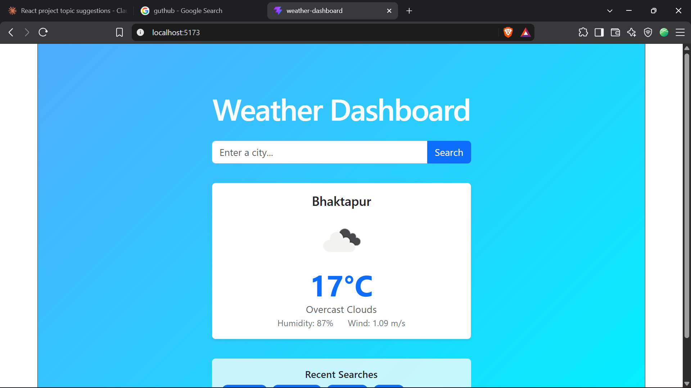
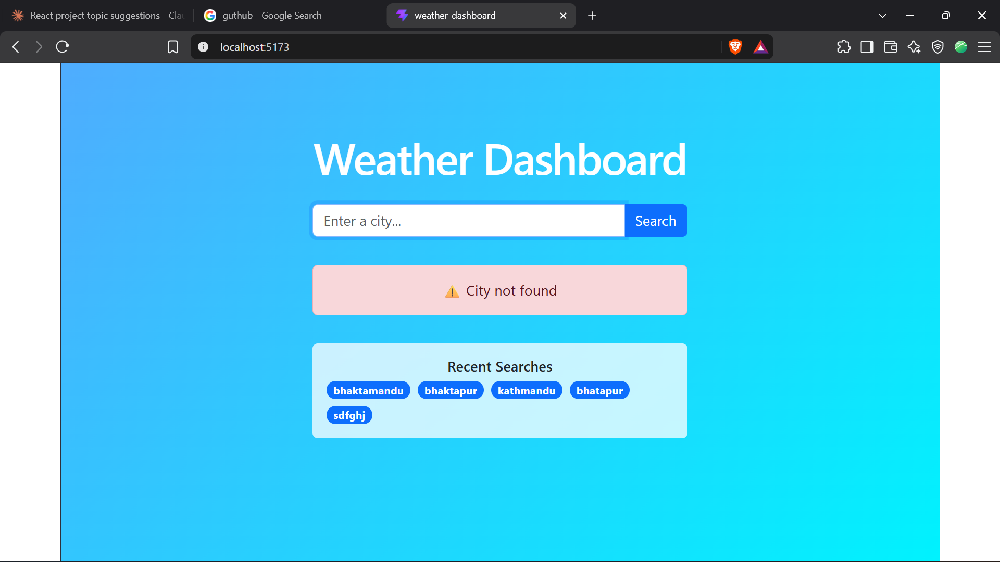

Weather Dashboard

A React-based weather lookup app that lets users search for any city and view current weather conditions in real time, using the OpenWeatherMap API.

Features

Search for any city and view live temperature, condition, humidity, and wind speed
Weather icon reflects current conditions
Loading state while fetching data
Error handling for invalid city names
Search history — last 5 searched cities, persisted with localStorage
Click a past search to instantly re-fetch that city
Responsive layout for desktop and mobile

Technologies Used

React (functional components + hooks)
Vite
Bootstrap 5
OpenWeatherMap API
localStorage for persistence

Setup Instructions

Clone this repository
   git clone https://github.com/BizzenKawan/weather-dashboard.git
   cd weather-dashboard
Install dependencies
   npm install
Create a .env file in the project root and add your own OpenWeatherMap API key:
   VITE_WEATHER_API_KEY=your_api_key_here
Run the development server
   npm run dev
Open the local URL shown in your terminal (usually http://localhost:5173)

Screenshots

Known Limitations

None — all core features are implemented and working as expected.

